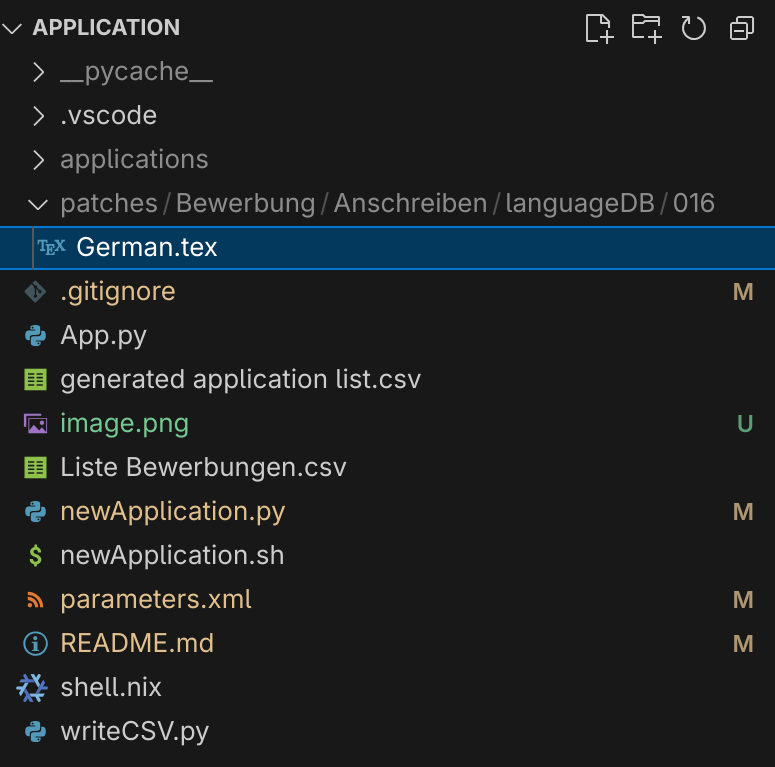

see also [https://github.com/MBanucu/application](https://github.com/MBanucu/application).

You can patch files after cloning by putting them into the same folder structure here under `patches`.
For example if you want to overwrite `Bewerbung/Anschreiben/languageDB/016/German.tex` then you do this:
